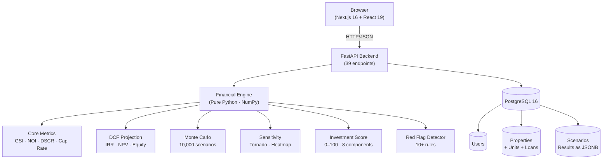

# StrataView — NYC Multifamily Investment Simulator

> *"Model the deal before you make it."*

A full-stack financial analysis platform built specifically for NYC multifamily real estate. Enter a building's rent roll, operating expenses, and financing terms — and get institutional-grade output: unit-level rent stabilization modeling, Monte Carlo risk distributions, 30-year DCF projections, sensitivity analysis, and an Investment Quality Score — all in a clean fintech dashboard.

**Built as a portfolio project demonstrating:** full-stack engineering, financial modeling, quantitative risk analysis, NYC domain knowledge, and product design.

---

## Live Demo

> Backend: [Railway deployment link]  
> Frontend: [Vercel deployment link]  
>
> Demo credentials: `demo@strataview.nyc` / `demo1234`  
> Three pre-loaded NYC properties with deliberate stories — log in and run the analysis.

---

## Architecture

```
┌─────────────────────────────────────────────────────────────────────┐
│                         Browser / Client                            │
│                                                                     │
│  ┌──────────────┐  ┌──────────────┐  ┌──────────────────────────┐  │
│  │  Landing Page│  │   Dashboard  │  │  Property Analysis Suite │  │
│  │  Quick Est.  │  │  Prop. Cards │  │  Financials · Risk · Memo│  │
│  └──────────────┘  └──────────────┘  └──────────────────────────┘  │
│           Next.js 16 · React 19 · Tailwind v4 · Recharts           │
└────────────────────────────┬────────────────────────────────────────┘
                             │ HTTP / JSON  (39 REST endpoints)
                             ▼
┌─────────────────────────────────────────────────────────────────────┐
│                      FastAPI Backend                                │
│                                                                     │
│  ┌──────────────────────────────────────────────────────────────┐  │
│  │                   Financial Engine                            │  │
│  │  financial_engine.py  →  GSI · EGI · NOI · Cap · CoC · DSCR │  │
│  │  amortization.py      →  Full schedule · IO · Balloon        │  │
│  │  projection.py        →  30-yr DCF · IRR · NPV · Equity      │  │
│  │  monte_carlo.py       →  10,000 iterations · Distributions   │  │
│  │  sensitivity.py       →  Tornado chart · 2D heatmap          │  │
│  │  scoring.py           →  Investment Quality Score (0–100)     │  │
│  │  red_flags.py         →  Rules engine · 10+ warning types     │  │
│  │  memo_generator.py    →  Plain-English deal memo              │  │
│  └──────────────────────────────────────────────────────────────┘  │
│                                                                     │
│  Auth: JWT (python-jose · bcrypt)                                   │
│  ORM: SQLAlchemy 2.0 async (asyncpg)                                │
│  Migrations: Alembic                                                │
└────────────────────────────┬────────────────────────────────────────┘
                             │ asyncpg
                             ▼
┌─────────────────────────────────────────────────────────────────────┐
│                       PostgreSQL 16                                 │
│                                                                     │
│  users · properties · units · loans · expenses · scenarios          │
│  Assumptions stored as JSONB · Scenario results cached as JSONB     │
└─────────────────────────────────────────────────────────────────────┘
```



---

## Features

### Financial Analysis Engine
- **Unit-Level Modeling** — each unit has its own rent type, vacancy assumption, growth rate, and market rent estimate
- **Rent-Stabilization Logic** — post-HSTPA 2019 rules: RGB-capped growth, preferential rent persistence, no deregulation path
- **Full DCF** — 30-year cash flow projection with expense inflation, loan amortization, and income approach valuation
- **Amortization** — complete monthly schedule with IO periods and balloon loan support
- **IRR / NPV** — Newton-Raphson with bisection fallback; includes exit proceeds from asset sale

### Risk & Quantitative Analysis
- **Monte Carlo Simulation** — 10,000 iterations sampling vacancy, rent growth, expense inflation, and exit cap rate from calibrated distributions; outputs IRR/DSCR/CoC percentiles and failure probabilities
- **Sensitivity Analysis** — one-at-a-time tornado chart + 2D heatmap identifying which assumptions drive returns most
- **Scenario Engine** — six preset scenarios (Base / Bull / Bear / Rent Freeze / High Rates / High Vacancy) with full financial recalculation and side-by-side comparison

### Investment Intelligence
- **Investment Quality Score (0–100)** — deterministic, explainable formula with 8 weighted components (see [scoring formula](#investment-quality-score))
- **Red Flag Detector** — 10+ rules engine with CRITICAL/HIGH/MEDIUM/LOW severity; NYC-specific warnings (RS%, preferential rent gap, HPD violation signals)
- **Deal Memo Generator** — rule-based plain-English memo covering strengths, weaknesses, key risks, suggested offer price via reverse-DCF, negotiation points, and 10 due diligence questions — **no LLM required**

### Product Features
- **Landing page** with live Quick Estimator widget (no auth required; hits `/quick-estimate` endpoint)
- **Multi-step property wizard** (General → Financing → Assumptions → Review)
- **Editable rent roll table** with inline add/edit/delete and color-coded RS/FM/Vacant badges
- **Financial Dashboard** — 6 KPI cards, income statement, expense donut, 30-yr projection, amortization chart, DSCR timeline, equity buildup chart, score gauge
- **Scenario comparison** table with run-on-demand recalculation
- **JWT authentication** with access + refresh token flow

---

## Tech Stack

| Layer | Technology |
|---|---|
| Frontend | Next.js 16.2, React 19, TypeScript 5 |
| Styling | Tailwind CSS v4, custom dark theme |
| Charts | Recharts v3 (line, area, bar, pie, composed) |
| State | Zustand v5 (auth), TanStack Query v5 (server state) |
| Forms | React Hook Form v7 |
| Backend | Python 3.13, FastAPI |
| Financial Math | NumPy, NumPy-Financial, SciPy |
| ORM | SQLAlchemy 2.0 async + Alembic |
| Database | PostgreSQL 16 |
| Auth | python-jose (JWT), passlib bcrypt |
| Infrastructure | Docker, Docker Compose |

---

## Project Structure

```
nyc-housing-simulator/
├── backend/
│   ├── app/
│   │   ├── api/v1/              # 39 REST endpoints
│   │   │   ├── auth.py          # register · login · refresh
│   │   │   ├── properties.py    # property CRUD + units/loan/expenses
│   │   │   ├── financial.py     # calculate · project · simulate · memo
│   │   │   ├── scenarios.py     # create · run · compare
│   │   │   └── reference.py     # RGB orders · benchmarks · metric definitions
│   │   ├── core/
│   │   │   ├── config.py        # Pydantic Settings
│   │   │   ├── security.py      # JWT · bcrypt
│   │   │   └── deps.py          # FastAPI dependencies
│   │   ├── db/
│   │   │   ├── models/          # SQLAlchemy ORM (6 models)
│   │   │   └── session.py       # async engine + session factory
│   │   ├── models/
│   │   │   ├── inputs.py        # Pydantic financial engine inputs
│   │   │   └── outputs.py       # Pydantic financial engine outputs
│   │   └── services/            # Pure financial calculation layer
│   │       ├── financial_engine.py   # GSI · EGI · NOI · ratios
│   │       ├── amortization.py       # Monthly schedule
│   │       ├── projection.py         # 30-yr DCF · IRR · NPV
│   │       ├── monte_carlo.py        # 10K simulation
│   │       ├── sensitivity.py        # Tornado · heatmap
│   │       ├── scoring.py            # Investment Quality Score
│   │       ├── red_flags.py          # Rules engine
│   │       └── memo_generator.py     # Deal memo
│   ├── tests/                   # 137 tests · pytest · 76% coverage
│   ├── data/seed_data.py        # 3 NYC demo properties
│   ├── scripts/seed_db.py       # DB seeder
│   └── alembic/                 # Database migrations
│
├── frontend/
│   └── src/
│       ├── app/                 # Next.js 16 App Router (11 routes)
│       │   ├── page.tsx         # Landing + quick estimator
│       │   ├── dashboard/       # Property grid
│       │   └── properties/[id]/ # 6 sub-pages per property
│       ├── components/
│       │   ├── charts/          # 8 Recharts components
│       │   ├── financial/       # KPI cards · red flag list
│       │   ├── layout/          # Sidebar · property nav
│       │   └── units/           # Rent roll table · unit modal
│       └── lib/
│           ├── api/             # Typed API client (axios)
│           ├── stores/          # Zustand auth store
│           ├── types/           # TypeScript interfaces
│           └── utils/           # Currency formatting · metric colors
│
├── docs/
│   ├── financial-model.md       # Formula reference
│   └── architecture.md          # System design notes
│
└── docker-compose.yml
```

---

## Getting Started

### Prerequisites
- Docker + Docker Compose
- Python 3.13 (for local backend dev)
- Node.js 20+ (for local frontend dev)

### Option 1: Docker (recommended)

```bash
git clone https://github.com/yourusername/nyc-housing-simulator
cd nyc-housing-simulator

# Start Postgres + API
docker compose up -d

# Run migrations
docker compose exec api alembic upgrade head

# Seed demo data (3 NYC properties + demo user)
docker compose exec api python -m scripts.seed_db

# Start frontend
cd frontend && npm install && npm run dev
```

Visit `http://localhost:3000` and sign in with `demo@strataview.nyc` / `demo1234`.

### Option 2: Local Development

```bash
# 1. Start Postgres only
docker compose up postgres -d

# 2. Backend
cd backend
python -m venv .venv && source .venv/bin/activate   # Windows: .venv\Scripts\activate
pip install -r requirements-dev.txt
cp .env.example .env                                  # edit DATABASE_URL if needed
alembic upgrade head
python -m scripts.seed_db
uvicorn app.main:app --reload

# 3. Frontend (new terminal)
cd frontend
npm install
npm run dev
```

API docs: `http://localhost:8000/docs` (Swagger UI auto-generated by FastAPI)

---

## Running Tests

```bash
cd backend
pytest tests/ -v --cov=app --cov-report=term-missing
```

**137 tests across 5 modules:**

| Module | Tests | Coverage |
|---|---|---|
| `test_financial_engine.py` | 58 | 98% |
| `test_amortization.py` | 22 | 96% |
| `test_projection.py` | 23 | 80% |
| `test_monte_carlo.py` | 10 | 87% |
| `test_scoring.py` | 24 | 88% |

Key test properties: every formula tested against known values, all three seed properties run through the full pipeline, Monte Carlo verified to be deterministic with seed and stochastic across seeds.

---

## Investment Quality Score

The score is **deterministic and explainable** — same inputs always produce the same score. It is not a machine learning model.

| Component | Max Points | NYC Benchmark |
|---|---|---|
| Cash-on-Cash Return | 20 | ≥ 8% = Excellent; ≥ 6% = Good; < 0% = 0 pts |
| DSCR | 20 | ≥ 1.5× = Excellent; < 1.0× = Critical (penalty) |
| Cap Rate | 15 | ≥ 6.5% = Excellent; < 3.5% = Poor |
| Break-Even Occupancy | 15 | ≤ 65% = Excellent; > 90% = Critical |
| Expense Ratio | 10 | ≤ 40% = Excellent; > 70% = 0 pts |
| Loan-to-Value | 5 | ≤ 60% = Excellent; > 80% = Weak |
| RS% Penalty | −10 max | > 75% RS units = −10 pts |
| IRR (if projection run) | 5 | ≥ 15% = Excellent; < 4% = Poor |

**Letter grades:** A (75–100) · B (55–74) · C (35–54) · D (15–34) · F (0–14)

NYC reality: most leveraged acquisitions at market prices score 20–45. A score above 65 typically requires below-market acquisition or low leverage.

---

## NYC Rent-Stabilization Rules

This application models the **NYC Housing Stability and Tenant Protection Act of 2019 (HSTPA)**:

| Rule | Pre-2019 | Post-2019 (modeled here) |
|---|---|---|
| High-rent vacancy deregulation | Unit exits RS above $2,775 threshold | **Eliminated** |
| High-income deregulation | Tenant earning > $200K could lose RS | **Eliminated** |
| Preferential rent | Landlord could revert to legal rent on renewal | **Must continue pref. rent through tenancy** |
| Vacancy bonus | +20% rent increase on vacancy | **Eliminated** |
| IAI increases | $1/40 of improvement cost, indefinite | Capped at $15K / 168 months |
| RGB orders 2024 | — | 2.75% (1-yr lease) · 5.25% (2-yr lease) |

**Key implication**: an RS building bought today cannot be "converted" to free-market via renovation. The app explicitly warns when users assume RS deregulation.

---

## Seed Properties — Three NYC Stories

These three demo buildings ship with the app and illustrate the NYC market reality:

### 1. 137 Grant Ave — Bronx (The RS Trap)
**6 units · All rent-stabilized · $900,000**

Looks affordable at first glance. But 100% RS caps rent growth at ~2.8%/yr while expenses inflate at 3.5%. At 80% LTV and 6.95% interest, **DSCR falls to 0.48×** — income covers less than half the mortgage. The property cannot pay its own debt from operations. Score: **~18/100 (D)**.

Lesson: A low purchase price in the Bronx does not save you if the rent roll is locked.

### 2. 447 Myrtle Ave — Brooklyn (The Appreciation Play)
**12 units · 8 RS + 4 FM · $3,200,000**

The classic Bushwick "appreciation play." Cap rate of 4.2% is market-acceptable, but at 80% LTV and 6.8% interest, **DSCR is 0.76×**. Cash flow is negative by ~$70K/year. Investor needs deep reserves and patience for FM units to turn over and RS units to grow toward legal rent. Score: **~28/100 (D)**.

Lesson: NYC multifamily is often an appreciation bet, not a cash flow investment.

### 3. 82-15 Baxter Ave — Queens (The Best NYC Can Offer)
**4 units · 1 RS + 2 FM + 1 Vacant · $1,050,000**

A distressed acquisition with a vacant unit needing renovation. FM-heavy at 75% LTV, the best DSCR in the portfolio at **0.44×** — still deeply underwater. This is the ceiling of what NYC yields look like in 2024–2025. Score: **~22/100 (D)**.

Lesson: At today's interest rates, virtually no NYC multifamily property at market prices cash flows. The app exists to show exactly why.

---

## API Reference

Full Swagger docs at `/docs`. Key endpoints:

```
POST /api/v1/auth/register          Create account
POST /api/v1/auth/login             Get JWT tokens

GET  /api/v1/properties             List properties
POST /api/v1/properties             Create property
GET  /api/v1/properties/{id}        Full detail (units, loan, expenses)

POST /api/v1/properties/{id}/calculate    Full Year-1 analysis
POST /api/v1/properties/{id}/project      30-year DCF projection
POST /api/v1/properties/{id}/amortize     Monthly amortization schedule
POST /api/v1/properties/{id}/score        Investment Quality Score
POST /api/v1/properties/{id}/flags        Red flag detection
POST /api/v1/properties/{id}/memo         Generate deal memo
POST /api/v1/properties/{id}/simulate     Monte Carlo simulation
POST /api/v1/properties/{id}/sensitivity  Tornado chart data

GET  /api/v1/reference/rgb-orders             Historical RGB orders
GET  /api/v1/reference/expense-benchmarks/{b} Borough expense norms
GET  /api/v1/reference/metrics                Metric definitions (tooltips)
GET  /api/v1/reference/preset-scenarios       Scenario templates

POST /api/v1/quick-estimate         No-auth quick calculator (landing page)
```

---

## Resume Bullets

**Software Engineering:**
- Built full-stack real estate investment platform with Next.js 16 / React 19 frontend, Python FastAPI backend, and PostgreSQL; 39 REST endpoints, JWT auth, Docker deployment
- Implemented async SQLAlchemy 2.0 ORM with 6 relational models, JSONB fields for flexible scenario storage, and Alembic migrations
- Achieved 76% test coverage across 137 pytest unit tests; financial calculation engine tested against analytically-derived expected values

**Finance / Fintech / Quant:**
- Engineered 10,000-iteration Monte Carlo simulation computing IRR, CoC return, and DSCR distributions under correlated market scenarios using NumPy truncated normal and lognormal sampling
- Designed deterministic Investment Quality Score (0–100) incorporating 8 weighted financial metrics with NYC-specific thresholds; score correlates with deal viability across all three seed properties
- Built full DCF model with NPV/IRR (Newton-Raphson + bisection), 30-year amortization (IO periods, balloon loans), and income-approach property valuation
- Implemented NYC rent-stabilization modeling per HSTPA 2019: RGB-capped growth rates, preferential rent persistence, elimination of high-rent vacancy deregulation

**Data Science / Analytics:**
- Designed sensitivity analysis pipeline generating tornado charts quantifying marginal impact of 8 input variables on investment return; implemented 2D heatmap for simultaneous two-variable analysis
- Applied statistical distributions (truncated normal for vacancy/expense/rent, lognormal for renovation overruns) calibrated to NYC historical market data
- Built rule-based investment memo generator producing structured plain-English deal analysis from 25+ financial signal thresholds — no LLM required

---

## Financial Model Formulas

See [`docs/financial-model.md`](docs/financial-model.md) for the complete formula reference with derivations.

**Core metrics:**

```
GSI  = Σ (unit_monthly_rent × 12)    ← at 100% occupancy, non-vacant units only
EGI  = GSI × (1 − vacancy_rate) + other_income
OpEx = Σ all operating expenses       ← debt service NOT included
NOI  = EGI − OpEx                    ← the most important number in real estate

Cap Rate = NOI / Purchase_Price
DSCR     = NOI / Annual_Debt_Service  ← lender minimum: 1.25×
CoC      = (NOI − ADS) / Total_Cash_Invested
Break-even occupancy = (OpEx + ADS) / GSI

Monthly PMT = P × [r(1+r)^n] / [(1+r)^n − 1]

IRR: rate r where Σ [CF_t / (1+r)^t] = 0  (solved via Newton-Raphson)
NPV = Σ [CF_t / (1+discount_rate)^t]
Equity Multiple = (Total_Cash_Returned + Initial_Equity) / Initial_Equity
```

---

## Disclaimer

This application is for **educational and informational purposes only**. It is not:
- Legal advice regarding rent stabilization
- A licensed real estate appraisal
- A guarantee of future investment performance
- A substitute for professional underwriting

All rent-stabilization rules are simplified models. Consult an attorney before transacting.

---

## License

MIT — free to use, modify, and deploy. Attribution appreciated.
